# Security Report — Fair Digital Dice Game

| | |
|---|---|
| **Course** | Software & Network Security |
| **Instructor** | Ioannis Marias |
| **Institution** | Athens University of Economics and Business |
| **Date** | March 2025 |

---

## Table of Contents

1. [Security Requirements](#1-security-requirements)
2. [Security Design & Countermeasures](#2-security-design--countermeasures)
3. [Cryptographic Protocol](#3-cryptographic-protocol)
4. [Protocol Sequence Diagram](#4-protocol-sequence-diagram)
5. [Technology Stack](#5-technology-stack)
6. [Application Walkthrough](#6-application-walkthrough)
7. [Security Assessment Tools](#7-security-assessment-tools)

---

## 1. Security Requirements

This section describes the security concerns that shaped the design of the application. Each subsection identifies a concrete problem and the requirement it imposes. The specific solutions and their implementation are covered in [Section 2](#2-security-design--countermeasures).

### 1.1 Maintaining Authenticated Identity

HTTP is stateless. Every request arrives without any inherent connection to previous ones. The requirement is a **session management mechanism** that can reliably associate subsequent requests with an authenticated user.

*(Implementation: [§2.1](#21-maintaining-authenticated-identity-sessions-over-jwts))*

### 1.2 Password Security

Passwords must never be stored in plaintext. The standard solution is to hash them, but not all hash functions are equally suitable. A general-purpose hash function like SHA-256 is designed to be fast, therefore an attacker that has obtained the hash can try billions of candidates per second on modern hardware. The requirement is to use a **purpose-built password hashing algorithm** that is deliberately slow and automatically salts each hash, making this approach impractical.

Hashing alone is not enough if users can choose trivially guessable passwords. The requirement is to enforce a **password complexity policy** that raises the minimum entropy of accepted passwords, making offline brute-force attacks more costly.

Even a complex password may have already appeared in a past breach and therefore be present in attacker wordlists. Because many users reuse the same password across multiple systems, the requirement is to **check candidate passwords against known data breaches** before accepting them.

*(Implementation: [§2.2](#22-password-security))*

### 1.3 Preventing SQL Injection

SQL injection occurs when user-supplied input is concatenated directly into a query string, allowing an attacker to break out of the intended query structure and inject their own SQL. Depending on the query, this can be used to bypass authentication, read arbitrary rows from any table, modify or delete data, or in some configurations execute operating system commands. The requirement is that all database queries use **parameterised statements**, where the query structure is fixed at compile time and user input is passed separately as a typed parameter.

*(Implementation: [§2.3](#23-sql-injection-prevention))*

*(Verification: [§7](#7-security-assessment-tools))*

### 1.4 Preventing Cross-Site Scripting (XSS)

XSS occurs when an attacker manages to have their JavaScript executed in the context of another user's browser session. In **stored XSS** the malicious script is saved to the database and served to every user who views the affected page. In **reflected XSS** the script is embedded in a crafted URL and executed when the server echoes part of the request back in the response. A successful XSS attack could steal the session identifier or forge authenticated requests on the victim's behalf. The OWASP recommendations to prevent XSS are to **HTML-encode all server-rendered values** so that injected markup is never interpreted as code, and to set a strict **Content Security Policy** that instructs the browser to refuse both inline scripts and scripts from origins that have not been explicitly whitelisted, so that even if unencoded output were introduced, injected code would not execute.

**Third-party JavaScript** represents an XSS vector entirely outside the application's control. Most web applications load scripts from external origins such as analytics libraries and CDN-hosted dependencies, and a single compromised script can inject arbitrary JavaScript into every page regardless of how carefully first-party code handles output. The requirement is to minimize external script dependencies.

*(Implementation: [§2.4](#24-xss-prevention))*

### 1.5 Preventing Cross-Site Request Forgery (CSRF)

CSRF exploits the browser's automatic attachment of session cookies to every request. A malicious page on a different origin can silently trigger a state-mutating request to this application and the browser will attach the victim's cookie, without the user's knowledge. The server, receiving a valid session cookie, cannot distinguish it from a legitimate request. The OWASP CSRF Prevention Cheat Sheet recommends the **Synchronizer Token Pattern** as the primary defense, where each mutating request must carry an unpredictable token tied to the user's session. A cross-site attacker cannot obtain this token because the browser's **Same-Origin Policy** prevents cross-origin page reads. As a defense-in-depth measure, cross-site cookie delivery should be restricted via **SameSite cookie attributes**.

*(Implementation: [§2.5](#25-csrf-protection))*

### 1.6 Preventing Cross-Origin Resource Sharing (CORS) Misconfiguration

Like CSRF, a **CORS misconfiguration** starts with the browser automatically attaching the session cookie to a cross-origin request. By default, however, the browser prevents the requesting page's JavaScript from reading the response. Cross-origin reads are blocked unless the server explicitly permits them via CORS headers. A misconfiguration, most commonly echoing the client-supplied `Origin` header back as `Access-Control-Allow-Origin` while also allowing credentials, instructs the browser to lift this restriction for the attacker's origin.

This application serves both its pages and its API from the same origin, so no cross-origin reads are needed. Without an explicit CORS configuration the server never sends `Access-Control-Allow-Origin` headers, and the browser's default **Same-Origin Policy** blocks all cross-origin reads. No additional implementation is required.

### 1.7 Preventing Clickjacking

Many browser actions, such as navigating to another page or opening a new window, require a user interaction event to execute. Browsers enforce this restriction to protect users, which makes user clicks a valuable resource that attackers have found ways to steal. In a **clickjacking** attack, the attacker loads the target application inside an `<iframe>` on a malicious page and renders an invisible layer over it. The victim believes they are interacting with the attacker's page, but their clicks are actually received by the framed application, potentially triggering state-mutating actions with the victim's authenticated session. Because the click originates from within the framed page itself, CSRF tokens offer no protection as the request carries a valid token and a valid session. The requirement is that the application must **prevent its pages from being rendered inside frames** controlled by other origins.

*(Implementation: [§2.6](#26-clickjacking-prevention))*

### 1.8 Ensuring Correct Access Controls

Broken access control, one of the most prevalent vulnerabilities in web applications, occurs when the server fails to enforce what authenticated users are permitted to do. The relevant form here is **Insecure Direct Object Reference (IDOR)**, where a user can access or manipulate resources belonging to another user at the same privilege level by tampering with a predictable identifier. Game records are identified by sequential integer IDs, so a player who knows their own game ID can trivially guess other players' IDs and interact with their games. The requirement is that all protected endpoints verify an authenticated session, and that every resource access additionally verifies **ownership** of the requested resource before allowing any interaction.

*(Implementation: [§2.7](#27-authorization-and-idor-prevention))*

### 1.9 Not Leaking Internal Information

Differences in error messages can allow an attacker to confirm which accounts exist, a technique known as **user enumeration**. A confirmed account list can then be fed into brute-force tools like Hydra for targeted credential attacks. The requirement is that authentication and registration endpoints must not disclose whether a given email address is registered.

Unhandled exceptions that surface stack traces to the client reveal class names, library versions, and internal paths. This **verbose error handling** gives an attacker free reconnaissance, turning every failed request into a source of intelligence about the system. The requirement is that all unhandled exceptions return a generic message to the client, with full detail logged server-side only.

*(Implementation: [§2.8](#28-information-leakage-prevention))*

### 1.10 Out of Scope

The following security concerns were identified but deliberately excluded from the implementation. Each item is acknowledged as a real-world requirement that would be addressed in a production system.

**User enumeration via registration** — The registration endpoint reveals whether an email address is already registered by returning a distinct error message. *(See [§2.8](#28-information-leakage-prevention) for further discussion.)*

**Brute-force prevention and account lockout** — The login endpoint imposes no limit on the number of failed authentication attempts. An attacker can repeatedly submit credentials without being slowed down or locked out. In production, this would be addressed with rate limiting (e.g. Spring Security's `AuthenticationFailureHandler` incrementing a counter) and a temporary account lockout (e.g. Spring Security's `UserDetails.isAccountNonLocked()`) after a threshold of consecutive failures.

**Multi-factor authentication (MFA)** — Authentication relies solely on a password. A compromised password grants full account access. MFA would add a second factor (e.g. TOTP via an authenticator app) so that knowledge of the password alone does not grant access.

**Encryption at rest** — Data stored in PostgreSQL and Redis is not encrypted at the storage level. An attacker with access to the underlying disk or memory could read user records and session data in plaintext. In production, database-level Transparent Data Encryption (TDE) and Redis encryption at rest would mitigate this.

**Security audit logging** — The application logs unhandled exceptions but does not record security-relevant events such as successful and failed login attempts, account registrations, or unauthorized access attempts. An audit trail for production systems is essential for incident detection, forensic investigation, and compliance.

---

## 2. Security Design & Countermeasures

This section documents the design decisions and concrete countermeasures that address the requirements identified in [Section 1](#1-security-requirements).

### 2.1 Maintaining Authenticated Identity: Sessions over JWTs

*(Requirements: [§1.1](#11-maintaining-authenticated-identity))*

**Authenticated identity is maintained through server-side sessions.** The session cookie is configured with `HttpOnly` (prevents JavaScript access), `Secure` (HTTPS-only transmission), and `SameSite=Strict` (CSRF mitigation) flags (`application.properties:25-29`), a 30-minute inactivity timeout, and a custom cookie name. Session fixation is prevented by migrating to a new session ID on login (`SecurityConfig.java:42`). Logout invalidates the server-side session and deletes the client-side cookie (`SecurityConfig.java:34-40`). Redis was chosen as the session store (`application.properties:21-22`), externalizing session state so that the application servers themselves are stateless with respect to sessions. Any application instance can handle any request by looking up the session ID in the shared store. This makes horizontal scaling straightforward, since adding more application instances behind a load balancer does not require sticky sessions. **The tradeoff is operational complexity.** Redis becomes a critical infrastructure component. It must be kept highly available (a Redis outage invalidates all active sessions), its access must be restricted, and it must be monitored and patched alongside every other component.

#### Why JWTs were not the right choice for this application?

One of the optional requirements in this assignment was the implementation of JWT-based authentication. After thorough research, we deliberately chose not to implement JWTs for browser session management. The following paragraphs document that decision and the reasoning behind it.

**JWTs were designed to transfer claims across trust boundaries, not to manage sessions.** The JWT specification (RFC 7519) defines a JSON Web Token as "a compact, URL-safe means of representing claims to be transferred between two parties." The canonical use cases are delegation scenarios such as OAuth 2.0 and OpenID Connect, where verified claims must cross trust boundaries. Our application is traditional server-side rendering web application. There is no federated identity, no microservices architecture, and no third-party integrations that require passing verified claims across trust boundaries. The problem JWTs were designed to solve simply does not exist in our system.

**Storing JWTs securely in the browser is a contradiction.** Any JWT that must survive a page refresh needs to be persisted somewhere. The two realistic options are `localStorage` or `sessionStorage` and an `HttpOnly` cookie. Storing a JWT in `localStorage` or `sessionStorage` exposes it to every piece of JavaScript running on the page, because there is no place in the browser that legitimate JavaScript can read while malicious JavaScript cannot. Third-party analytics scripts, CDN-loaded libraries, browser extensions, and any future dependency can trivially exfiltrate it via a Cross-Site Scripting (XSS) attack. Storing the JWT in an `HttpOnly` cookie eliminates the XSS exfiltration risk, but at that point the JWT is functionally identical to a traditional session cookie with extra steps. It simply adds complexity and overhead with no security benefit.

**Stateless JWTs cannot be invalidated.** A stateless JWT is valid until its expiry timestamp, by design. This means that if a user's session is compromised, if a user changes their password, or if an administrator revokes a user's access, the JWT remains valid until it naturally expires. The only correct solution to this problem is to maintain a server-side blacklist of invalidated tokens, which reintroduces statefulness and negates the entire scalability argument for JWTs in the first place. Traditional server-side sessions, by contrast, can be invalidated instantly by deleting or expiring the session record, giving the application full control.

**Server-side sessions transmitted via cookies are the battle-tested standard.** In this approach, the browser stores only a session identifier in a cookie, while the actual session state remains on the server. Major web frameworks have supported this approach for years, and it has been hardened through extensive production use and security research. Frameworks make it easy to set cookie attributes such as `HttpOnly` (prevents JavaScript access), `Secure` (HTTPS-only transmission), and `SameSite=Strict` (CSRF mitigation), and all modern browsers enforce those attributes. Rolling a JWT-based session system means assuming responsibility for the correctness of token generation, signing key management, expiry logic, and invalidation. These are all areas where the security community has documented real-world vulnerabilities and implementation mistakes, including in major providers.

### 2.2 Password Security

*(Requirements: [§1.2](#12-password-security))*

**Countermeasures:**

1. **BCrypt hashing** — `SecurityConfig.java:73-75` registers a `BCryptPasswordEncoder` bean. Unlike general-purpose hash functions, BCrypt is designed specifically for password storage: slow by construction and with automatic per-hash salting.

2. **Password complexity policy** — `RegisterRequest.java:22-26` enforces via Bean Validation:
   ```
   ^(?=.*[A-Z])(?=.*[!@#$%^&+=.]).{12,}$
   ```
   Minimum 12 characters, at least one uppercase letter, at least one special character. An additional check in `AuthController.java:54-56` requires at least 4 distinct characters (since regex cannot count unique characters).

3. **HaveIBeenPwned breach check** — `SecurityConfig.java:78-80` registers a `HaveIBeenPwnedRestApiPasswordChecker` bean. `UserService.java:39-50` calls it during registration. The check uses the k-anonymity API (sends only the first 5 hex characters of the SHA-1 hash of the password, not the password itself), so the plaintext password is never transmitted to the external service. If the external service is unavailable, the check is skipped and a warning is logged.

### 2.3 SQL Injection Prevention

*(Requirements: [§1.3](#13-preventing-sql-injection))*

**Countermeasures:**

1. **Parameterized queries** — All database access uses Spring Data JPA. `GameRepository.java:15-17` uses `@Lock` + `@Query` with a JPQL named parameter (`@Param("id")`). No raw SQL strings and no string concatenation appear anywhere in the codebase.

### 2.4 XSS Prevention

*(Requirements: [§1.4](#14-preventing-cross-site-scripting-xss))*

**Countermeasures:**

1. **Thymeleaf output encoding**: Thymeleaf's `th:text` (`game.html:42-46`, `login.html:13-14`, `register.html:13`) HTML-encodes all server-rendered values, making it a safe sink. Attribute values use `th:attr` (`game.html:48`), which applies the same encoding at the attribute level. User-controlled data that reaches the browser, specifically the first name (`game.html:15`) and the email address echoed in the duplicate-registration error (`register.html:13`), always passes through one of these safe sinks.

2. **Content Security Policy (defense-in-depth)**: `SecurityConfig.java:48-57` adds a strict CSP as a second layer of defense against XSS. If unencoded output were ever introduced through a future change, the browser would refuse to execute injected scripts: `script-src 'self'` blocks both inline execution and scripts from external origins. `connect-src 'self'` restricts which URLs page scripts may contact, limiting an attacker's ability to exfiltrate data silently. `form-action 'self'` prevents form hijacking and must be set explicitly as it does not fall back to `default-src`. Finally, the application loads no third-party scripts, eliminating supply-chain XSS entirely.

3. **Input validation (hardening)**: Before any user-controlled value reaches a sink, it is validated against a strict format at the request boundary. `clientNonceHash` and `clientNonce` are validated against `^[a-f0-9]{64}$` (`InitiateGameRequest.java:7-10`, `RevealRequest.java:7-10`), making injection structurally impossible for those fields. `@Email` (`RegisterRequest.java:19`) constrains the email format. `@Size(max=100)` (`RegisterRequest.java:11,15`) bounds the free-text name fields. Input validation is not a substitute for output encoding, but the narrower the accepted format, the fewer values that could cause harm if encoding were ever missing will go through.

### 2.5 CSRF Protection

*(Requirements: [§1.5](#15-preventing-cross-site-request-forgery-csrf))*

**Countermeasures:**

1. **Synchronizer Token Pattern.** Spring Security's CSRF filter issues a per-session CSRF token. HTML forms use `th:action` which automatically injects the hidden `_csrf` field. For `fetch` calls in the game, `dice-game.js:19-22` reads the token and header name from data attributes on a hidden DOM element (`game.html:13`), and sends the token via the `X-CSRF-TOKEN` request header (`dice-game.js:26-28`, `44`). This scheme works because the **Same-Origin Policy** prevents a cross-origin attacker page from reading the DOM of this application. Even if the victim has our application open in another tab, the attacker cannot extract the CSRF token from the hidden element, making the token unguessable.

2. **SameSite=Strict cookie** — `application.properties:29`. Even without the CSRF token, the browser will not attach the session cookie to cross-site requests, providing defense-in-depth.

### 2.6 Clickjacking Prevention

*(Requirements: [§1.7](#17-preventing-clickjacking))*

**Countermeasures:**

1. **CSP `frame-ancestors 'none'`** (`SecurityConfig.java:55`). Modern browsers will refuse to render the page in any frame.

2. **`X-Frame-Options: DENY`** (`SecurityConfig.java:58`) via `frameOptions(frame -> frame.deny())`. Defense-in-depth for older browsers that do not support CSP frame control.

### 2.7 Authorization and IDOR Prevention

*(Requirements: [§1.8](#18-ensuring-correct-access-controls))*

**Countermeasures:**

1. **Server-side identity resolution** — The user's ID is extracted from the server-side session via `@AuthenticationPrincipal` (`GameController.java:29,38,48`), never accepted from the client. This ensures the server decides who is making the request, regardless of what the client sends.

2. **Resource ownership check** — `GameService.java:56-58` immediately after acquiring the pessimistic lock on the game row, the service checks `isOwnedBy(game, userId)`. If the authenticated user's ID does not match `game.getUser().getId()`, a `GameAccessDeniedException` is thrown, resulting in a 403 response. This check is inside the `@Transactional` lock boundary, so there is no window between the ownership check and the state mutation.

### 2.8 Information Leakage Prevention

*(Requirements: [§1.9](#19-not-leaking-internal-information))*

**Countermeasures:**

- **Generic error page** — `GlobalExceptionHandler.java:37-47` catches all uncaught exceptions and renders a generic "An unexpected error occurred." message. The full exception is logged server-side only.

- **Generic login failure message** — `AuthController.java:32` sets `"Invalid username or password."` without distinguishing whether the email does not exist or the password is wrong. This prevents user enumeration via the login endpoint.

- **User enumeration via registration (accepted risk)** — `UserService.java:24-26` throws `AlreadyExistsException` when a registration attempt uses an already-registered email, and the error message is surfaced to the user. This allows an attacker to probe which email addresses have accounts by attempting registrations. The standard mitigations are a silent-success flow that always returns the same response regardless of whether the account exists, or a CAPTCHA to throttle automated probing. Both were considered and deemed out of scope for this assignment. The risk is acknowledged and accepted.

---

## 3. Cryptographic Protocol

### 3.1 Protocol Overview

The dice game uses a **commit-reveal scheme with joint randomness derivation** to provide verifiable fairness between the client and the server. Unlike a simple commitment to a pre-chosen value, neither party selects its dice roll. Both rolls are **derived deterministically from both parties random nonces** after mutual commitment. This means neither party can influence the outcome by choosing a favorable number.

The protocol involves two random nonces:
- **r_a** — 256-bit server nonce generated by `SecureRandom` on the JVM (`GameService.java`).
- **r_b** — 256-bit client nonce generated by `crypto.getRandomValues` in the browser (`dice-game.js`).

And two commitments (one per party):
- **c_a** = SHA-256(r_a) — server's commitment, returned in Phase 1
- **c_b** = SHA-256(r_b) — client's commitment, sent in Phase 1

Dice rolls are derived after both nonces are revealed:
```
serverRoll = (first4BytesAsUint32(SHA-256("server" || r_a || r_b)) % 6) + 1
clientRoll = (first4BytesAsUint32(SHA-256("client" || r_a || r_b)) % 6) + 1
```

### 3.2 Phase 1 — Commit

1. The browser generates **r_b**: a 32-byte array filled by `crypto.getRandomValues`, then hex-encoded to a 64-character string (`dice-game.js`). `crypto.getRandomValues` is a Cryptographically Secure Pseudo-Random Number Generator (CSPRNG) provided by the browser's Web Cryptography API. The browser immediately computes **c_b** = SHA-256(r_b) via `crypto.subtle.digest` and stores `r_b` locally for Phase 2.

2. The browser sends `POST /game` with `{ clientNonceHash: c_b }`. The request body is validated by `InitiateGameRequest.java:7-10` to ensure it is exactly 64 lowercase hex characters.

3. On the server, `GameService.initiateGame()`:
   - Generates **r_a**: 32 bytes by `SecureRandom` (`GameService.java`), hex-encoded.
   - Computes **c_a** = SHA-256(r_a).
   - Persists the `Game` entity with `r_a`, `c_b`, and `c_a` (columns `r_a`, `client_nonce_hash`, `server_nonce_hash` — `V4__create_games_table.sql`). No dice rolls are stored yet.

4. Server responds with `{ gameId, serverNonceHash: c_a }`. The client stores both.

At this point **both parties have committed**: the server is bound to r_a (cannot change it without invalidating c_a, which the client holds), and the client is bound to r_b (cannot change it without invalidating c_b, which the server stored). Neither party knows the other's nonce, so neither can evaluate the derived outcome yet.

### 3.3 Phase 2 — Reveal

1. The browser sends `POST /game/{id}/reveal` with `{ clientNonce: r_b }`. The request body is validated by `RevealRequest.java:7-10` to ensure it is exactly 64 lowercase hex characters.

2. On the server, `GameService.revealNonces()`:
   - Checks ownership (`isOwnedBy`).
   - Checks idempotency: if the game is already `COMPLETED`, returns the existing result.
   - Verifies **c_b**: computes SHA-256(r_b) and compares with the stored `client_nonce_hash`. If they differ, throws `InvalidNonceException` → 400 BAD_REQUEST.
   - Derives **serverRoll** = `(first4BytesAsUint32(SHA-256("server" || r_a || r_b)) % 6) + 1`.
   - Derives **clientRoll** = `(first4BytesAsUint32(SHA-256("client" || r_a || r_b)) % 6) + 1`.
   - Checks expiration: if more than 60 seconds have elapsed since `initiatedAt`, sets outcome to `EXPIRED`. Otherwise calls `determineOutcome(serverRoll, clientRoll)`: server wins if `serverRoll > clientRoll`, client wins if `clientRoll > serverRoll`, tie if equal.
   - Persists the updated `Game` and returns `{ serverNonce: r_a, serverRoll, clientRoll, gameOutcome }`.

3. The browser receives the response and performs **full verification** (`dice-game.js`):
   - Verifies SHA-256(r_a) == c_a (the serverNonceHash stored from Phase 1).
   - Independently recomputes serverRoll and clientRoll using the same derivation function.
   - If either check fails, displays "Server cheating detected! Commitment verification failed."

### 3.3 Potential Weaknesses and Accepted Risks

#### Server Trust on Outcome Determination
The commitment scheme guarantees that both rolls were derived from the committed nonces, which neither party can change after committing. The client independently verifies this by recomputing both rolls from the revealed nonces (`dice-game.js`). However, the current client-side verification does not explicitly re-apply the comparison rule (`serverRoll > clientRoll → SERVER_WIN`). However, since both rolls are visible to the client, it can easily be detected by looking at the results table's rolls, so this is a minor known limitation.

---

## 4. Protocol Sequence Diagram

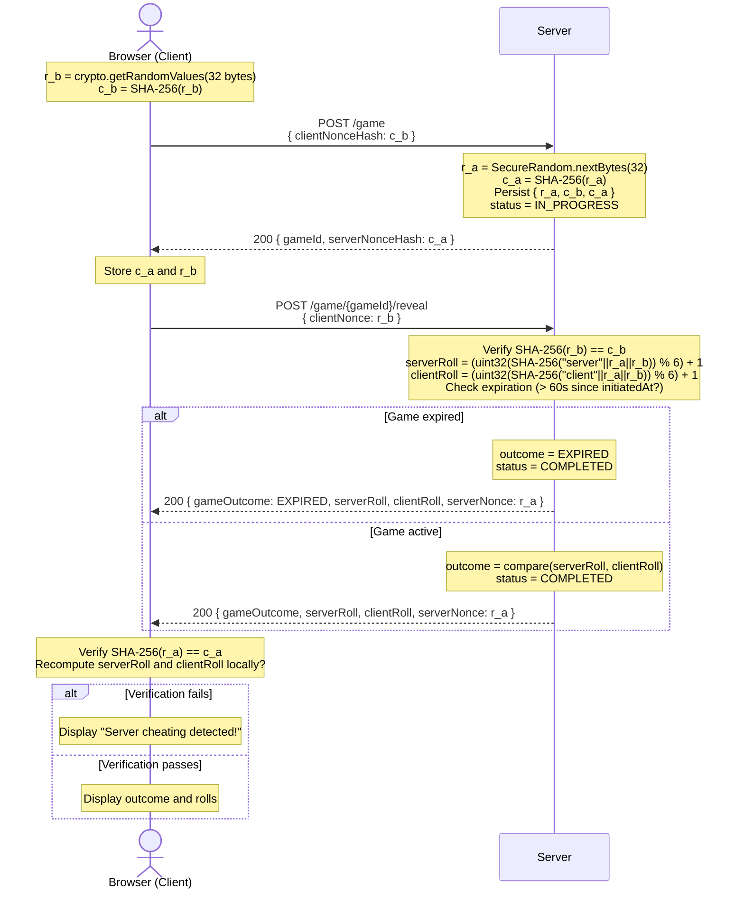

**Diagram notes:**
- Both parties commit to their nonces (by publishing only the hash) before either knows the other's nonce. This prevents either party from choosing a nonce that produces a favorable derived roll.
- No dice rolls are stored or selected during Phase 1. Both rolls are derived deterministically in Phase 2 from the joint input `(r_a, r_b)`.
- The server verifies the client's commitment (`SHA-256(r_b) == c_b`) before performing any derivation, ensuring the client cannot substitute a different nonce after seeing c_a.
- The client verifies both the server's nonce commitment (`SHA-256(r_a) == c_a`) and the correctness of both reported rolls by independently recomputing them.

---

## 5. Technology Stack

### 5.1 Core Application Stack

| Technology | Version | Role |
|---|---|---|
| Java | 17 | Server-side programming language |
| Spring Boot | 3.5.10 | Framework and embedded server (Tomcat) |
| Spring Security | 6 (Managed by Boot) | Authentication, authorization, CSRF protection, security headers, etc |
| Thymeleaf | 3 (Managed by Boot) | Server-side HTML templating with auto-escaping |
| Vanilla JavaScript | ES2020 | Client-side programming language (no frameworks or external libraries) |

### 5.2 Persistence

| Technology | Version | Role |
|---|---|---|
| PostgreSQL | 17 | Primary relational database |
| Spring Data JPA / Hibernate | Managed by Boot | ORM layer |
| Flyway | Managed by Boot | Database schema migrations |

### 5.3 Session Management

| Technology | Version | Role |
|---|---|---|
| Redis | 7 | In-memory session store |
| Spring Session Data Redis | Managed by Boot | Externalizes `HttpSession` to Redis, enabling stateless application servers |

### 5.4 Build & Developer Tooling

| Technology | Role |
|---|---|
| Maven | Build tool and dependency management |
| Lombok | Compile-time code generation to reduce boilerplate |
| Bean Validation (Jakarta Validation / Hibernate Validator) | Declarative input validation on request DTOs via `@Valid` |

### 5.5 Testing

| Technology | Role |
|---|---|
| JUnit 5 | Test framework |
| Spring Boot Test | Full application context for integration tests |
| Testcontainers (PostgreSQL + Redis) | Ephemeral, real PostgreSQL and Redis instances per test run — no mocking of persistence or session store |

---

## 6. Application Walkthrough

This section walks through the application's screens in the order a user would encounter them.

### 6.1 Registration — Input Validation

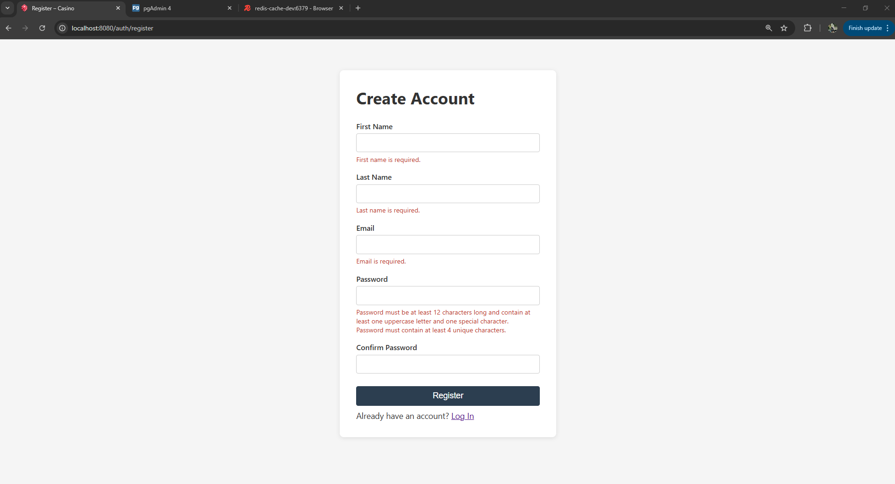

New users create an account by providing their first name, last name, email address, and a password. If any field is missing or the password does not meet the complexity requirements, clear error messages appear inline beneath each field explaining what needs to be corrected.

### 6.2 Post-Registration Redirect to Login

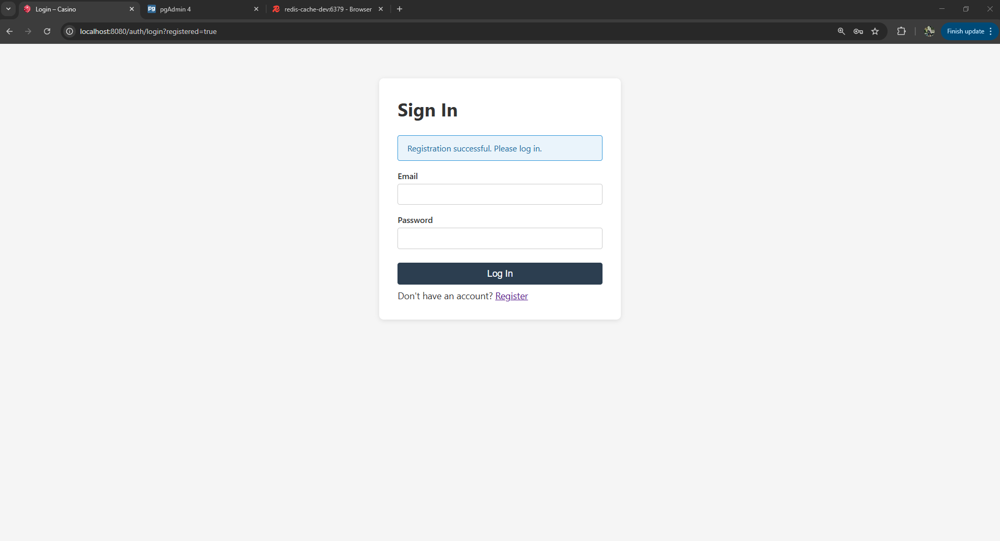

On successful registration the user is redirected to the login page, which displays a confirmation banner — *"Registration successful. Please log in."*

### 6.3 Login — Generic Error Message

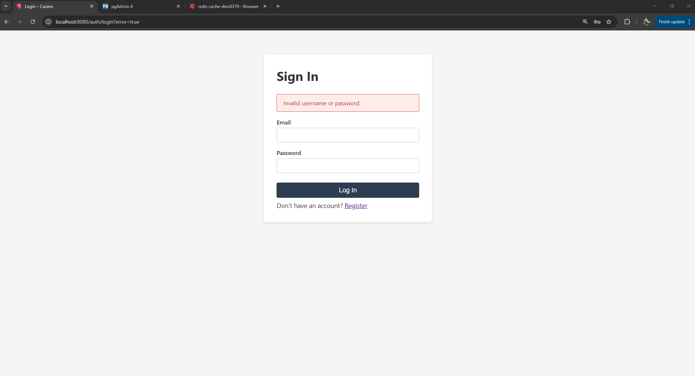

If the provided credentials do not match any account, the login page displays the generic message *"Invalid username or password."* without indicating whether the email address exists or not.

### 6.4 Game Page — Initial State

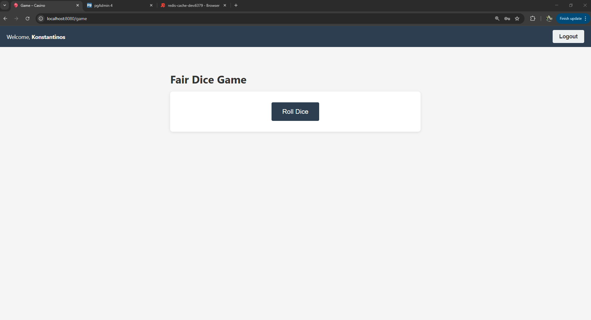

After logging in for the first time, the user is taken to the game page. The navigation bar shows a personalised greeting and a Logout button. The page presents a single "Roll Dice" button to start a game.

### 6.5 Game — Client Win

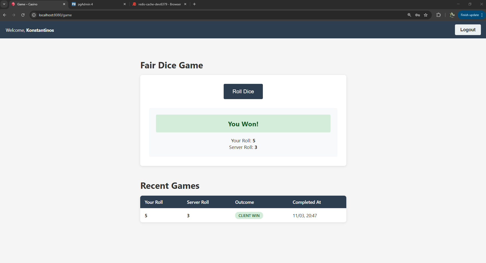

After clicking "Roll Dice", the result is displayed immediately. A green banner announces *"You Won!"* with both dice rolls shown beneath it. The Recent Games table below is populated with the completed game.

### 6.6 Game — Server Win

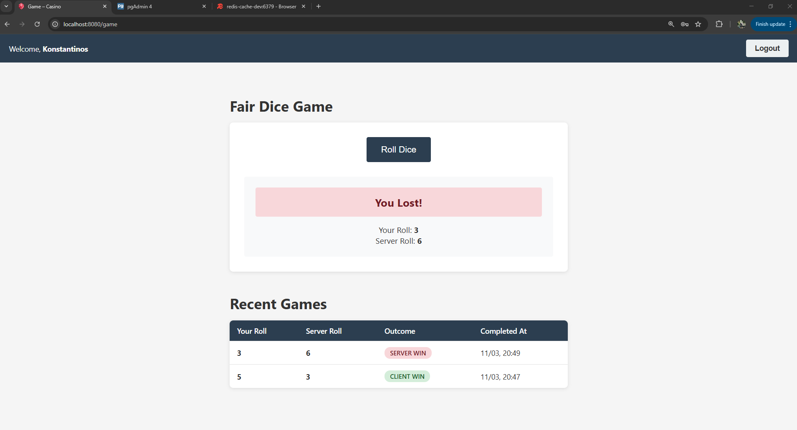

When the server's roll is higher, a red banner announces *"You Lost!"*. The Recent Games table grows to reflect the new result, with the most recent game at the top.

### 6.7 Game — Tie

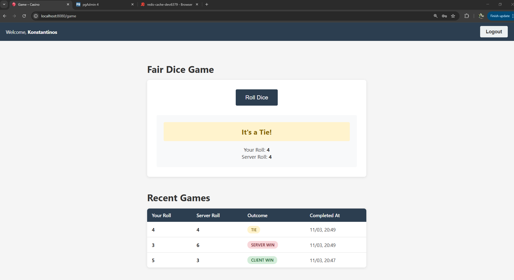

When both rolls are equal, a yellow banner announces *"It's a Tie!"*. At this point the Recent Games table shows all three possible outcomes, CLIENT WIN, SERVER WIN, and TIE.

### 6.8 Server Cheating Detection

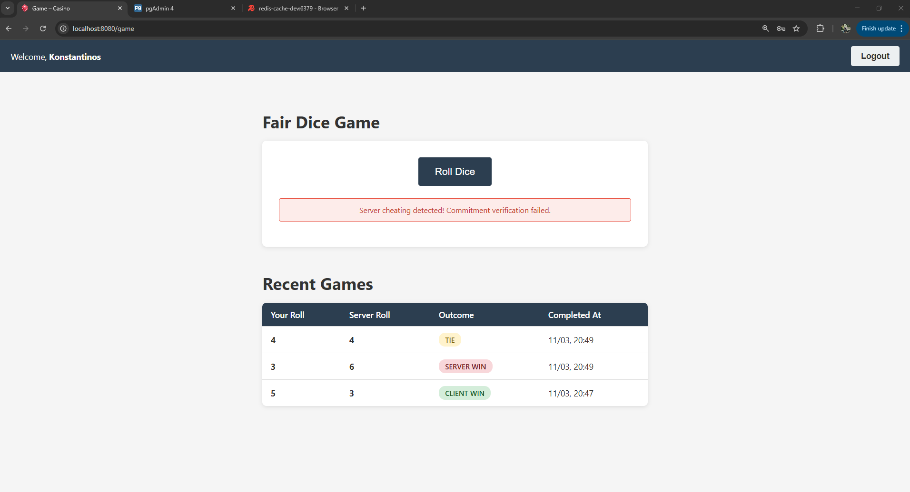

If the server attempts to tamper with the result after committing, the browser detects the inconsistency and displays *"Server cheating detected! Commitment verification failed."* instead of any outcome. The game is considered void.

### 6.9 Client Nonce Corruption — Generic Error Page

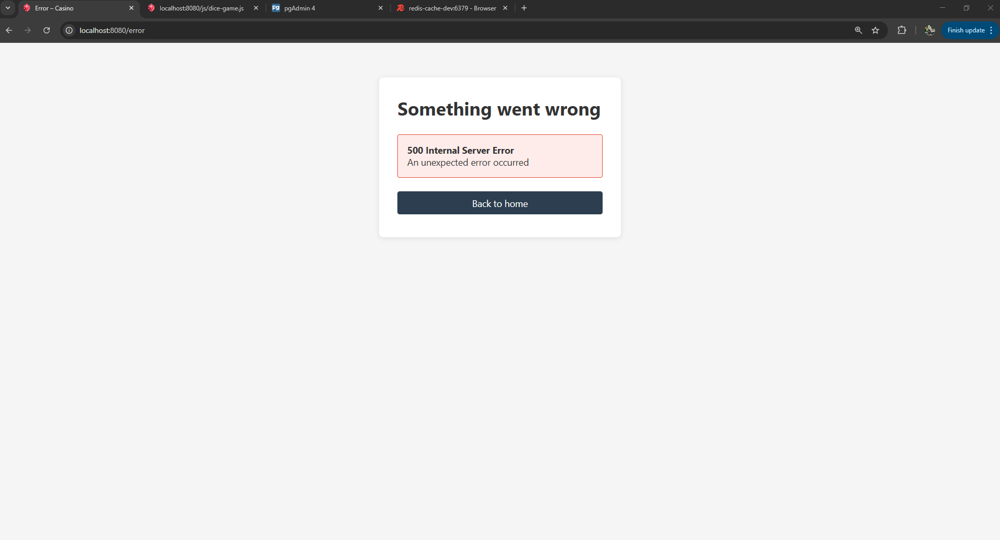

If the client nonce is corrupted or tampered with before being sent to the server, the application rejects the request and redirects to a generic error page stating that *"Something went wrong / An unexpected error occurred."* No internal details are disclosed to the user.

### 6.11 Logout


Clicking "Logout" immediately ends the session. The user is redirected to the login page with the confirmation *"You have been logged out."* Navigating back to the game page without re-authenticating redirects to login.

### 6.12 Game History Persisted Across Sessions

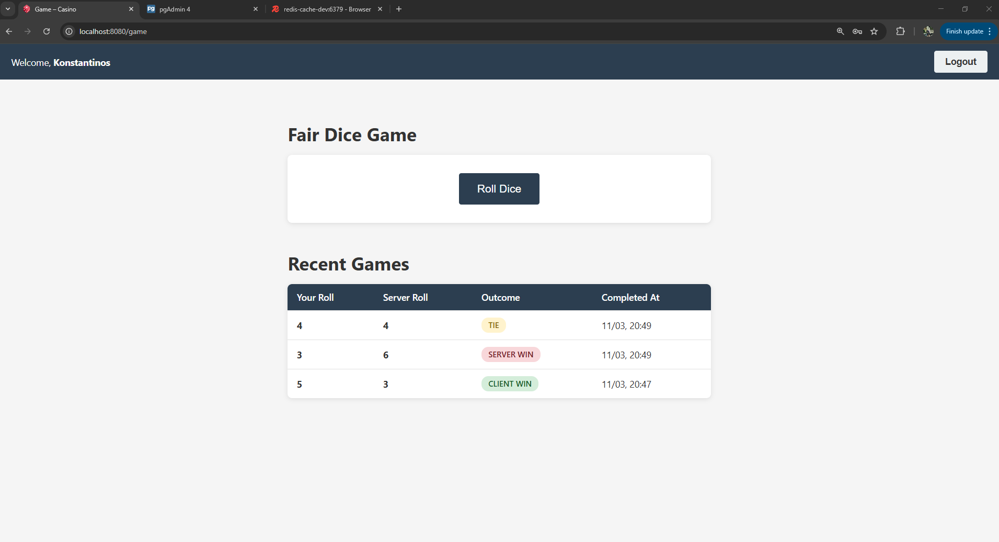

After logging back in, the Recent Games table still shows all previously completed games. A player's history is tied to their account, not their current session, so it is always available regardless of how many times they have logged out and back in.

---
 
## 7. Security Assessment Tools
 
This section describes the tools used to perform a black-box security assessment of the running application, focusing on SQL Injection testing. The assessment was carried out on a local Kali Linux virtual machine.
 
### 7.1 Environment Setup
 
The application repository was cloned from GitHub onto the Kali Linux VM:
 
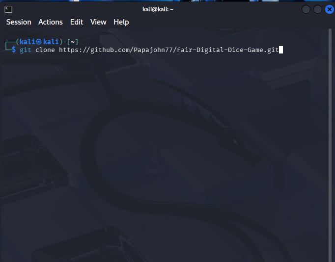
 
PostgreSQL & Redis were started via Docker Compose:
 
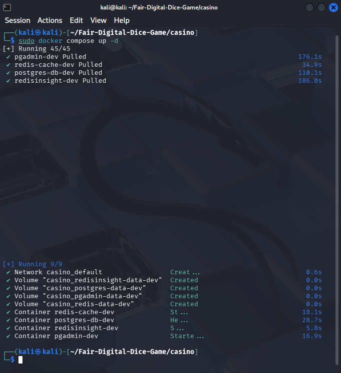
 
With the prerequisite containers running, the Spring Boot application was built and launched:
 
```
chmod +x mvnw
./mvnw package
java -jar target/casino-0.0.1-SNAPSHOT.jar
```
 
The application was now accessible at `http://localhost:8080`.
 
### 7.2 Burp Suite — Traffic Capture and Export
 
**Burp Suite Community Edition** was used as an intercepting proxy to capture the HTTP traffic exchanged between the browser and the application:
 
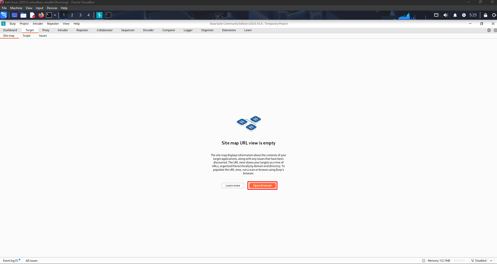
 
After launching Burp Suite, its built-in Chromium browser was used to navigate through the full application workflow so that all relevant endpoints would appear in the Proxy HTTP history:
 
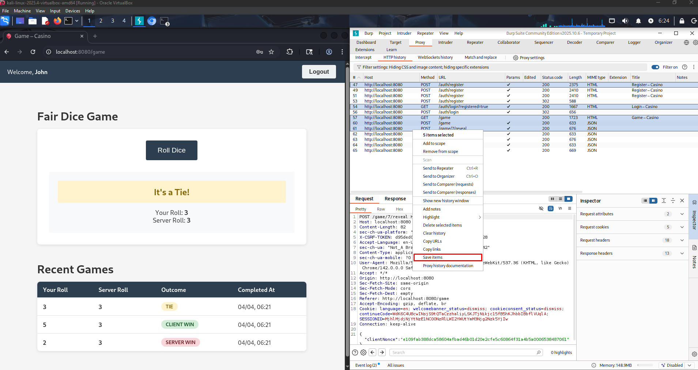
 
The captured requests were then selected and exported to a log file (`casino.log`) via the *Save items* menu option. This log file serves as the input for the subsequent automated testing:
 
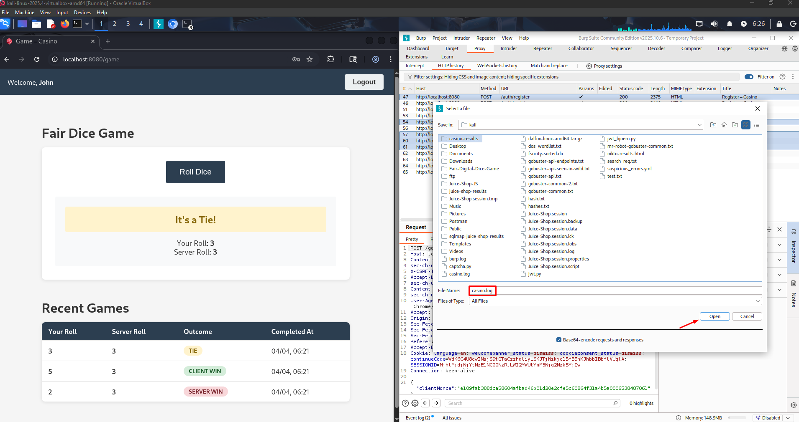
 
### 7.3 sqlmap — Automated SQL Injection Testing
 
**sqlmap** is an open-source penetration testing tool that automates the detection and exploitation of SQL Injection vulnerabilities. It supports a wide range of database management systems and injection techniques such as including boolean-based blind, time-based blind, error-based, UNION-based, and stacked queries.
 
The Burp Suite log file was fed directly into sqlmap with the following command:
 
```
sqlmap -l casino.log \
  --batch \
  --scope=".*localhost:8080.*" \
  --level=3 \
  --risk=2 \
  --output-dir=./casino-results
```
 
`--level` controls the breadth of tests performed. Level 1 tests only the most common injection points while level 5 tests everything including HTTP headers and cookies. Level 3 was chosen as a pragmatic middle ground to include testing of HTTP headers such as `User-Agent` and `Referer` without the excessive noise of higher levels.

`--risk` controls how destructive the payloads can be. Risk 1 uses only safe read-only payloads, risk 2 additionally enables heavy time-based blind injection tests, and risk 3 adds OR-based payloads which can corrupt data when injected into UPDATE or DELETE statements. Risk 2 was chosen to increase detection coverage with time-based tests while avoiding payloads that could modify or corrupt the application database.
 
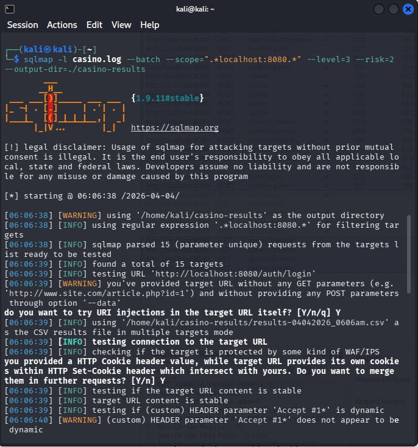
 
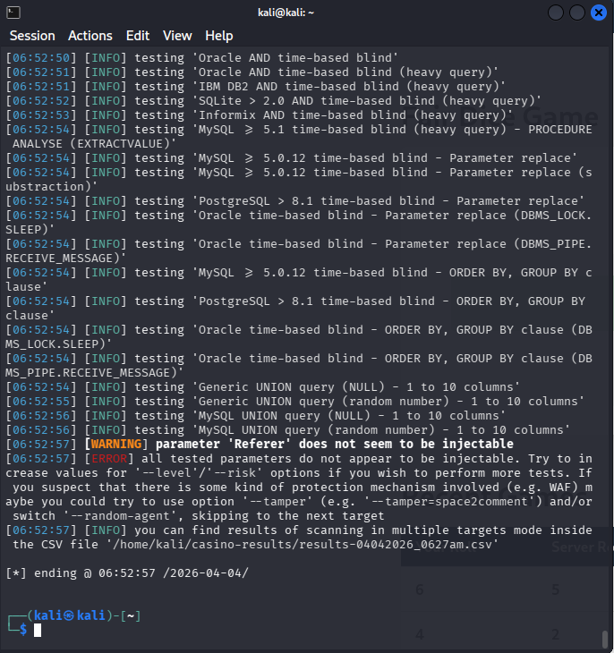
 
**Result: no SQL Injection vulnerabilities were identified.** All tested parameters were reported as not injectable. This outcome is consistent with the application's use of parameterised queries throughout ([§2.3](#23-sql-injection-prevention)): Spring Data JPA with JPQL named parameters ensures that user input is never concatenated into SQL strings, eliminating the injection vector entirely.

---

## 8. Author

- Ioannis Papadatos
